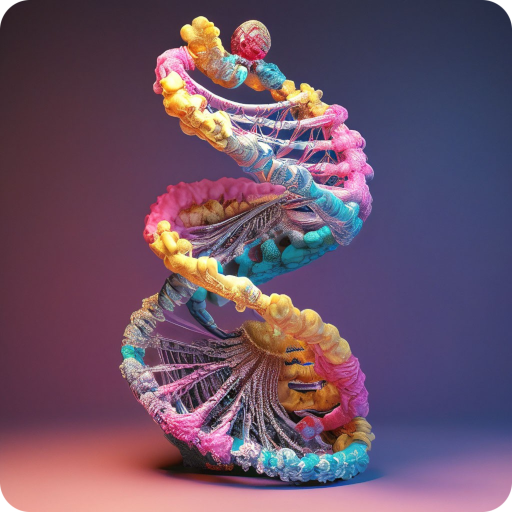
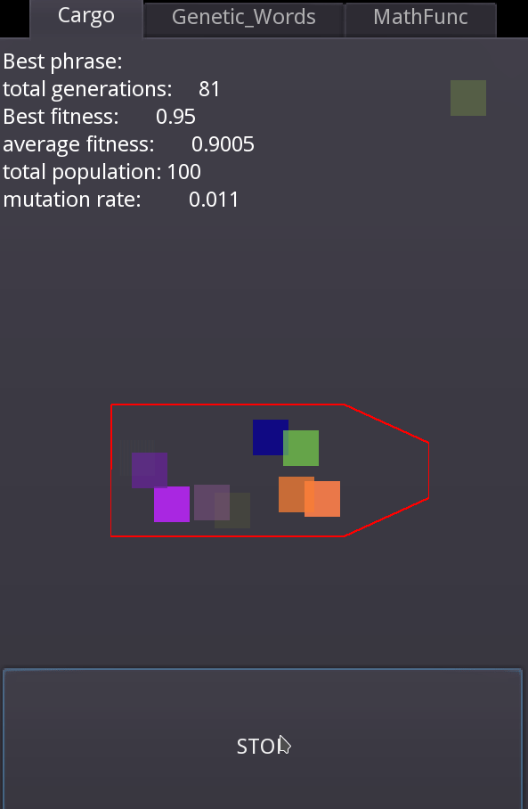

##   
 Genetic algorithm Godot 

---

## **Оглавление**

- [ Genetic algorithm Godot ](#-genetic-algorithm-godot-)
- [**Оглавление**](#оглавление)
  - [**Проект Genetic algorithm Godot**](#проект-genetic-algorithm-godot)
    - [**Технологии:**](#технологии)
  - [**Запуск проекта**](#запуск-проекта)
- [**Автор**](#автор)

---
# Генетический алгоритм на игровом движке Godot

Данный проект представляет собой реализацию генетического алгоритма на игровом движке Godot. В рамках проекта были реализованы три варианта генетического алгоритма: условное размещение груза в заданной площади, подбор фразы и математическая функция подбора параметров.

Проект был разработан в учебных целях и может быть использован в качестве примера реализации генетического алгоритма на игровом движке Godot. Каждый из трех вариантов алгоритма имеет свои особенности и может быть использован для решения различных задач.

## Условное размещение груза

В этом варианте генетического алгоритма необходимо разместить грузы в заданной площади таким образом, чтобы максимизировать заполнение этой площади. Для этого используется генетический алгоритм, который на каждом поколении создает новые варианты расположения грузов и выбирает лучший из них. необходимо доработать фитнес функцию.

## Подбор фразы

В этом варианте генетического алгоритма необходимо подобрать фразу, которая максимально соответствует заданному шаблону. Для этого используется генетический алгоритм, который на каждом поколении создает новые варианты фраз и выбирает лучший из них.

## Математическая функция подбора параметров

В этом варианте генетического алгоритма необходимо подобрать параметры математической функции таким образом, чтобы она максимально соответствовала заданным данным. Для этого используется генетический алгоритм, который на каждом поколении создает новые варианты параметров и выбирает лучший из них.

## Использование проекта

Для использования проекта необходимо установить игровой движок [Godot версии 3.5](https://godotengine.org/download/3.x/) или выше. Затем необходимо открыть один из трех вариантов генетического алгоритма и запустить его.

#### **Технологии:**

- 

## Автор

[Александр Андреевич](https://github.com/Zolibot)

